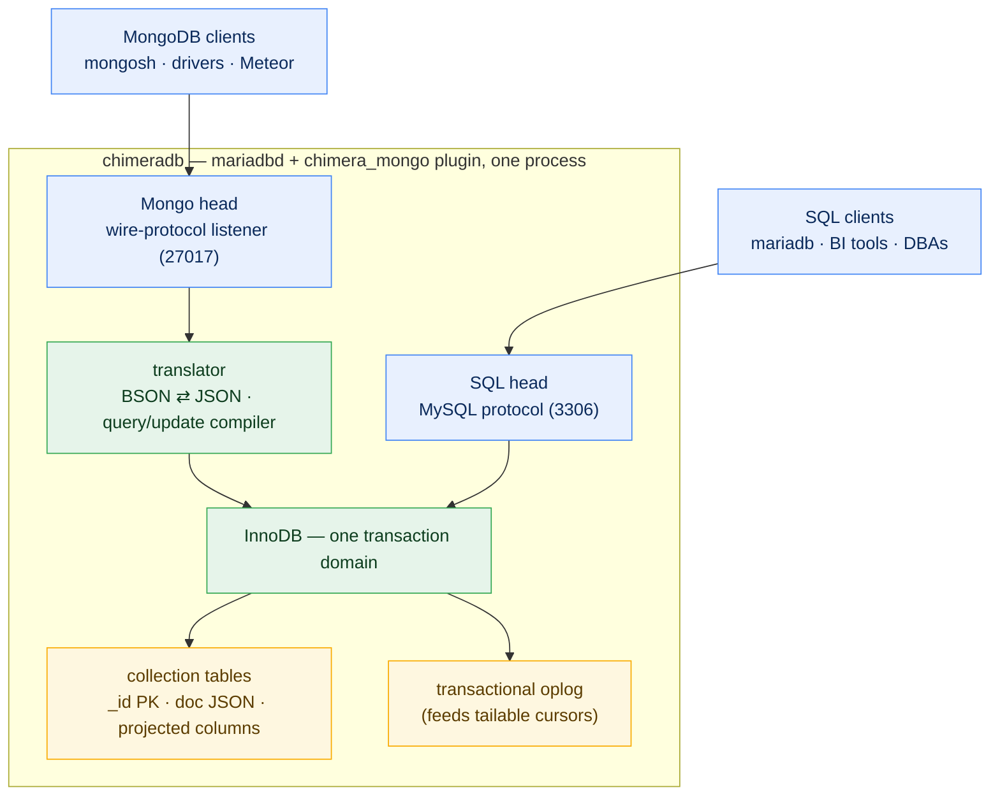

# ChimeraDB

**One database. Two heads. Zero glue.**

  

ChimeraDB is MariaDB that speaks MongoDB. Your application writes documents over
the Mongo wire protocol; your DBA queries indexed relational columns with SQL;
your Meteor app tails a real oplog — and all of it is **the same data, in the
same InnoDB engine, committed in the same transaction**. No sync pipeline, no
CDC lag, no second database to back up, no drift. The document is the source of
truth; the relational schema is a *projection* of it, maintained by the engine
itself.

> Keep the document. Project the rows. Query it both ways.

---

## TL;DR — get started in 60 seconds

Install:

```sh
# macOS
brew install chimeradb

# Debian / Ubuntu
sudo apt install chimeradb

# Fedora / RHEL
sudo dnf install chimeradb

# Docker
docker run -p 3306:3306 -p 27017:27017 chimeradb
```

Already run MariaDB 10.11 or 11.8? ChimeraDB is just a plugin:

```sql
INSTALL SONAME 'chimera_mongo';
```

Start it and talk to **both heads**:

```sh
chimeradb start
mongosh mongodb://127.0.0.1:27017/appdb     # the document head
mariadb  -h 127.0.0.1 appdb                 # the relational head
```

The whole idea in four statements:

```js
// 1. Your app writes a document (mongosh / any driver / Meteor)
db.todos.insertOne({ text: "ship it", done: false, owner: "dana" })
```

```sql
-- 2. Your DBA reads it as a table, right now, same transaction domain
SELECT JSON_VALUE(doc, '$.text') FROM appdb.todos;

-- 3. The DBA "relationalizes" the parts worth indexing — one ALTER.
--    The engine backfills from every existing document during the ALTER.
ALTER TABLE appdb.todos
  ADD COLUMN owner VARCHAR(64) AS (JSON_VALUE(doc, '$.owner')) PERSISTENT,
  ADD INDEX (owner);
```

```js
// 4. Mongo queries on that path are now index-backed. Nothing to deploy.
db.todos.find({ owner: "dana" })
```

Running Meteor? Point it at ChimeraDB and reactivity just works — oplog tailing
included:

```sh
export MONGO_URL="mongodb://127.0.0.1:27017/meteor"
export MONGO_OPLOG_URL="mongodb://127.0.0.1:27017/local"
meteor run
```

---

## What it is



Every MongoDB collection **is** an InnoDB table:

| Piece | What it is |
|---|---|
| `_id` | Primary key (ObjectId, string, and int ids all supported) |
| `doc` | The full document, unmodified — the **canonical source of truth** |
| Projected columns | `forward` (default): `GENERATED ALWAYS AS (JSON_VALUE(doc,'$.path'))` — indexed, typed, engine-maintained, read-only. `bidirectional`: a real column whose direct SQL `UPDATE` **writes through to the document** |
| Oplog | An InnoDB table appended *inside the same transaction* as every mutation |
| Projection modes | `manual` (DBA curates via `ALTER`), `eager` (auto), `lazy` (virtual, on demand) |

Forward projections are `GENERATED ALWAYS` columns, so **drift is impossible by
construction**: the column cannot disagree with the document, cannot be written
directly, and is updated atomically with the document in the same InnoDB
transaction. Adding one to a billion existing documents is one `ALTER` — the
rebuild *is* the backfill. Columns you declare `bidirectional` become directly
`UPDATE`-able instead: a generated trigger writes the change through to the
document (which always remains the source of truth), trading the engine's
generated-column guarantee for plain-SQL writability.

### The party tricks

- **SQL writes appear live in Meteor.** An `UPDATE … SET doc = JSON_SET(doc, …)`
  from the `mariadb` client fires a trigger, lands in the oplog, wakes the
  tailing cursor, and shows up in every connected browser via DDP — no refresh.
- **A transactional oplog.** Real MongoDB's oplog is a replication artifact.
  ChimeraDB's oplog is written in the same transaction as the write itself: it
  never shows rolled-back operations and is strictly commit-ordered. Meteor's
  observe driver was never fed this well.
- **Both query languages, both directions.** Run SQL from a Mongo client
  (`db.runCommand({chimeraSql: "SELECT …"})`) and verbatim mongosh statements
  from SQL (`SELECT mongo('db.todos.find({ done: false })')`) — see
  [One prompt, both languages](#one-prompt-both-languages).
- **One backup, one transaction domain, one port pair.** `mariabackup` covers
  your documents, your projections, and your oplog — because they are one
  database.

---

## One prompt, both languages

The same `mariadb>` prompt accepts your relational habits *and* your document
habits — against the same rows.

**Reading** (works with any projected column):

```sql
SELECT *
FROM users
WHERE email = 'doug@example.com'
LIMIT 1;

SELECT mongo('db.users.findOne({ email: "doug@example.com" })');
```

**Writing** — declare the column `bidirectional` once, and plain SQL writes
through to the document:

```sql
CALL chimera_add_projection('appdb.users', '$.name', 'name', 'VARCHAR(190)', 'bidirectional');

UPDATE users
SET name = 'Douglas Horner'
WHERE email = 'doug@example.com';

CALL mongo('db.users.updateOne(
  { email: "doug@example.com" },
  { $set: { name: "Douglas Horner" } }
)');
```

Both writes are equivalent — and identical to the same `updateOne` arriving
over the wire protocol: each updates the document, lands exactly one entry in
the transactional oplog, and appears live in every tailing Meteor client.

The `mongo()` gateway takes your mongosh statement **verbatim** — paste the
line inside quotes and go. Truly naked `db.users.findOne({…})` at the SQL
prompt would require forking MariaDB's parser, and refusing to fork the server
is the promise that keeps ChimeraDB a drop-in plugin. If you want one REPL that
speaks both languages natively, `chimerash` is on the roadmap: a thin client
that routes SQL over the MySQL protocol and mongo statements over the wire
protocol.

**Quoting rules.** The gateway parses its argument with mongosh (JS) string
semantics, so single- and double-quoted strings are interchangeable *inside*
the statement. The part to watch is the SQL lexer around it. Under MariaDB's
default `sql_mode`, both of these work:

```sql
SELECT mongo('db.users.findOne({ email: "doug@example.com" })');
SELECT mongo("db.users.findOne({ email: 'doug@example.com' })");
```

But the second form breaks under `ANSI_QUOTES` (as in `sql_mode=ANSI`), where
double quotes delimit *identifiers*, not strings. House style: **single-quote
the SQL, double-quote the JSON inside** — immune to `sql_mode`, and it matches
canonical Extended JSON. Two lexer reminders: apostrophes in data are doubled
per SQL (`"O''Brien"`), and backslashes are consumed once by the SQL lexer
unless `NO_BACKSLASH_ESCAPES` is set (write `\\d` for a regex `\d`).

---

## Why: the cathedral, the bazaar, and forty years of impedance mismatch

Eric Raymond's *The Cathedral and the Bazaar* contrasted two ways software gets
built: the cathedral — carefully architected, reviewed, released deliberately —
and the bazaar — organic, fast, evolving under real use. Data has the same two
temperaments, and we've been forcing them into one shape for decades.

**The relational schema is a cathedral.** Designed up front, normalized,
constrained, indexed, governed. It's what your DBAs, your BI tools, your
auditors, and your integrations need — and it's *right* to be slow-moving.

**The application's data is a bazaar.** Objects grow fields mid-sprint,
structures nest, shapes vary by record. It's what your developers actually have
in memory — and it's *right* to be fast-moving.

The industry's first answer was the ORM: map the bazaar onto the cathedral from
the client side. That gave us the **object-relational impedance mismatch** —
the N+1 queries, the lazy-loading landmines, the leaky mapping layers Ted
Neward famously called *"the Vietnam of computer science."* Every ORM is a
client-side treaty between two models that disagree, renegotiated per
application, enforced by nobody.

The second answer was NoSQL: let the bazaar win. Document stores dissolved the
mismatch by *abandoning the cathedral* — and organizations spent the next
fifteen years bolting reporting systems, CDC pipelines, and data warehouses
back on, because it turns out the cathedral was load-bearing.

The current answer is to run **both** databases and shuttle data between them
with change-data-capture — which is where consistency goes to die: two engines,
two transaction domains, eventual agreement at best, silent divergence at
worst.

**ChimeraDB's answer: stop shuttling.** Let the bazaar write and the cathedral
read, *in the same engine*. Developers ship documents without asking permission.
DBAs erect exactly the relational structure the organization needs — one
`ALTER` at a time, backfilled by the engine, guaranteed consistent because a
generated column physically cannot drift from its document. The treaty between
the two models is enforced by InnoDB's transaction log instead of a mapping
layer's good intentions.

---

## Origins: YORM, and moving the projection into the server

ChimeraDB is the server-side descendant of
[**YORM**](https://github.com/mieweb/yorm) — the *Yjs Object-Relational
Mapper* — whose thesis is the same inversion of the classic ORM:

> Keep the object. Project the rows.
> One canonical object. Any number of relational projections.

YORM proved the model at the application tier: the serialized object (a
collaborative CRDT document) stays canonical and intact, while versioned,
deterministic, replayable mappings project it into ordinary relational tables
that DBAs can own — including tables added *years after* the documents were
created, populated by replaying the mapping over every stored document.

ChimeraDB asks: what if the projection didn't live in the application tier at
all? Push it into the database server, and properties YORM must engineer for
become properties the engine simply *has*:

| YORM (application tier) | ChimeraDB (inside the engine) |
|---|---|
| Projection runs inline/queued/batch, tracked by checkpoints | Projection is a `GENERATED ALWAYS` column — synchronous and atomic with the write, always |
| Replay repopulates new tables from stored documents | `ALTER TABLE … ADD COLUMN … PERSISTENT` — the rebuild is the replay |
| Projection lag is observable | Projection lag does not exist |
| Outbox + reverse mapper turn SQL edits into document changes | Triggers + the transactional oplog make SQL writes document-visible events |
| Deterministic mappings keep rows rebuildable | The document column *is* the recovery source, in the same table |

The two projects are complementary: YORM is the right shape when the canonical
object is a live collaborative CRDT and the projection targets are external
systems. ChimeraDB is the right shape when you want the projection guaranteed
by the storage engine itself — and a MongoDB-compatible front door on top.

---

## Compatibility

| | |
|---|---|
| MariaDB (host server) | **10.11 LTS** and **11.8 LTS** |
| Wire clients | `mongosh`, legacy `mongo` shell, official drivers (Node, Python, Go, …) |
| Frameworks | **Meteor 2 & 3** (oplog tailing supported — first-class target), Mongoose, raw drivers |
| Command surface | CRUD (`insert`/`find`/`update`/`delete`/`findAndModify`), cursors incl. **tailable + awaitData**, `count`/`distinct`, index & collection management, aggregation subset (`$match`, `$group`, `$sum`, `$count`, `$project`, `$sort`, `$limit`, `$skip`), sessions |
| Storage encoding | MongoDB Extended JSON (canonical) — ObjectId, Date, Timestamp, Decimal128, Binary all round-trip |
| Explicitly not supported | change streams, `$where` (server-side JS), map-reduce, sharding admin (`local.oplog.rs` tailing covers the reactive use case) |

ChimeraDB advertises exactly what it implements in the `hello` handshake — it
never lies to a driver about features.

## Building from source

Everything is scripted (the scripts are the documentation of record):

```sh
git clone https://github.com/mieweb/chimeradb && cd chimeradb
./chimera/scripts/build-plugin.sh --server 11.8    # or --server 10.11
./chimera/scripts/run-server.sh   --server 11.8
./chimera/scripts/test.sh         --server 11.8    # unit + differential + e2e
```

The plugin builds out-of-tree against stock, unpatched MariaDB sources — the
only thing that ever touches the server tree is a regenerable symlink. See
[chimeraDB-plan.md](chimeraDB-plan.md) for the milestone plan and architecture
decisions, and [build-plan.md](build-plan.md) for the base-server build notes.

## FAQ

**Is this a MongoDB fork?** No. ChimeraDB contains zero MongoDB source code.
The wire protocol is a cleanroom implementation from public documentation
(the approach FerretDB proved viable), which is what keeps the whole stack
GPLv2 + Apache-2.0 and freely redistributable.

**Is it a proxy or translation gateway?** No. The listener is a daemon plugin
*inside* `mariadbd` — same process, same transactions, no network hop between
"the Mongo part" and "the SQL part."

**Where does my data actually live?** In InnoDB tables you can point at:
one row per document, the full document in a `JSON` column, plus whatever
projected columns exist. `mariadb-dump` it, replicate it, `mariabackup` it —
it's just MariaDB.

**Can SQL corrupt my documents?** Forward projections can't be written at all.
Bidirectional columns accept `UPDATE`s and write through to the document via a
generated trigger — the document remains the single source of truth. Direct
`UPDATE`s to `doc` must still produce valid JSON (enforced by check). Every
path flows into the oplog, so document readers see all of it.

**What happens on a type mismatch?** Permissive by default (`JSON_VALUE` →
NULL + warning), matching MariaDB semantics; a strict mode is on the roadmap.

**Why not just use FerretDB?** FerretDB is a great Mongo-on-Postgres proxy.
ChimeraDB's difference is the *projection thesis*: documents and DBA-curated
relational columns in one engine-enforced transaction domain — plus in-process
oplog tailing tuned for Meteor.

## Roadmap

Wire-level multi-document transactions (they map naturally onto InnoDB), SCRAM
authentication on the Mongo listener, eager auto-projection policies, a
filter→SQL fast path, and `chimerash` — a dual-language REPL that accepts naked
SQL *and* naked mongosh at one prompt — are tracked in
[chimeraDB-plan.md](chimeraDB-plan.md) (Milestone 8). Contributions welcome —
start there.

## License & trademarks

ChimeraDB is licensed under the **GPLv2** (the same license as the MariaDB
server it extends). BSON handling uses Apache-2.0 `libbson`. ChimeraDB contains
no SSPL-licensed code.

*MongoDB is a trademark of MongoDB, Inc. MariaDB is a trademark of MariaDB plc.
ChimeraDB is an independent project and is not affiliated with, endorsed by, or
sponsored by MongoDB, Inc. or MariaDB plc. "MongoDB compatibility" describes
wire-protocol interoperability, not provenance.*
