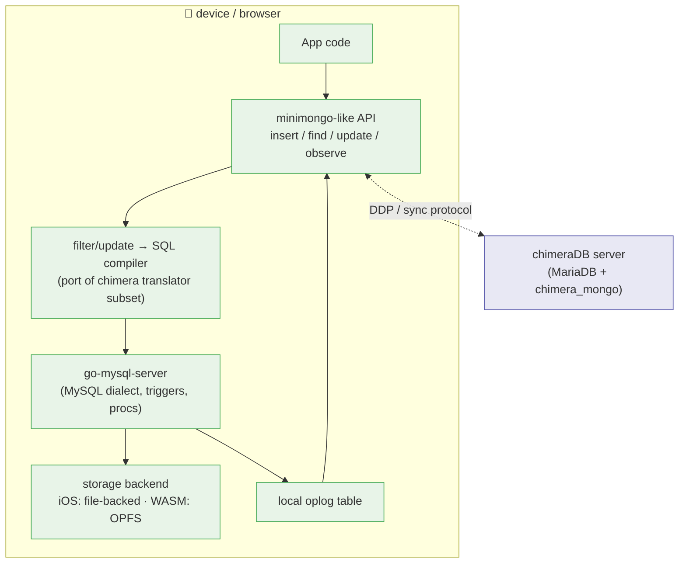

# chimera-lite — mobile / embedded / browser idea

**Status:** exploration only — nothing here is committed roadmap.
**Date:** 2026-08-10
**Relation to chimeraDB:** [chimeraDB-plan.md](chimeraDB-plan.md) builds the *server*
(MariaDB + Mongo head). This note explores the *client/edge* end of the same story: a
local, embeddable engine with a **minimongo-like API for local persistence**, so a mobile
or browser app gets the same "document + SQL projection" model offline.

---

## 1. Is there a "MariaDBLite" (like PGlite / SQLite)?

**No.** Nothing like PGlite exists for MariaDB/MySQL. The realistic options:

| Option | What it is | Browser (WASM) | iOS | Dialect fidelity |
|---|---|---|---|---|
| `libmysqld` (embedded server) | The whole MariaDB server as an in-process library — lives in [mariadb-server/libmysqld](mariadb-server/libmysqld) | ❌ no port exists; heavily threaded, signal-dependent, huge | ⚠️ plain C/C++ so *conceivable*, but GPLv2 vs App Store + size + zero upstream support | 100% (it *is* MariaDB) |
| MariaDB-in-a-VM | Full server inside x86 emulation (v86 / WebVM / container2wasm) | ✅ works as a stunt; huge & slow | ❌ | 100% |
| **`go-mysql-server`** (Dolt engine) | Pure-Go MySQL-dialect engine + wire server, Apache-2.0, pluggable storage backends | ✅ **proven** — see §2b (`-tags gms_pure_go` + one-line vendor patch) | ✅ plausible (gomobile; Apache-2.0 is App-Store-safe) | ~90% (reimplementation) |
| SQLite / DuckDB / PGlite | The incumbents | ✅ | ✅ | ❌ not MySQL dialect |

**Why PGlite worked for Postgres but not here:** Postgres has a true single-process /
single-user mode and a comparatively small core. MariaDB has no such mode — even
`libmysqld` spins InnoDB background threads and assumes a real filesystem and signals.

### Triggers & stored procedures in the embedded options

- **`libmysqld`** — full support (same code paths: [sql/sql_trigger.cc](mariadb-server/sql/sql_trigger.cc),
  [sql/sp_head.cc](mariadb-server/sql/sp_head.cc)). Documented restrictions are elsewhere:
  no replication, no loadable UDF plugins.
- **`go-mysql-server`** — triggers (`BEFORE`/`AFTER` × `INSERT`/`UPDATE`/`DELETE`,
  multiple per event) ✅ *(verified locally — see §2)*; stored procedures with control
  flow, cursors, handlers ✅; stored functions (`CREATE FUNCTION`) historically lag —
  verify before relying on them; `CREATE EVENT` basic support.

---

## 2. What's checked out & verified locally

`go-mysql-server/` is cloned at the workspace root (gitignored, same policy as the other
vendored trees). Verified on this machine (macOS arm64, Go auto-toolchain → 1.26.2):

```sh
# ICU is the one cgo dependency (REGEXP functions). Use CPPFLAGS so BOTH the
# C and C++ cgo compiles see the same Homebrew ICU — CXXFLAGS alone links
# against mismatched (unversioned) symbols and fails.
export CGO_CPPFLAGS="-I/opt/homebrew/opt/icu4c/include"
export CGO_LDFLAGS="-L/opt/homebrew/opt/icu4c/lib"

cd go-mysql-server
go build ./...          # BUILD OK
cd _example && go run . # in-memory server on 127.0.0.1:3306
```

Smoke-tested with the real MariaDB client against it:

```sql
mysql -h 127.0.0.1 -P 3306 -u root mydb
SELECT * FROM mytable;                     -- works, JSON column included
CREATE TRIGGER t1 BEFORE INSERT ON mytable
  FOR EACH ROW SET NEW.name = UPPER(NEW.name);
INSERT INTO mytable (name, email, phone_numbers, created_at)
  VALUES ('trigger test','t@x.com','[]',NOW());
SELECT name FROM mytable WHERE email='t@x.com';   -- → TRIGGER TEST ✅
```

Observed caveats:

- The bundled **`memory` backend is not persistent** and doesn't support savepoints
  (trigger rollback logs an error but the trigger itself works). Persistence requires a
  storage backend — that's the integration point (§4).
- **ICU cgo is optional after all:** upstream ships a pure-Go regex fallback behind the
  **`gms_pure_go` build tag** (`internal/regex/regex_pure.go`) — no shim needed for
  cgo-less targets. (Native builds without the tag still need the Homebrew ICU flags
  above.)
- **In-process API quirk:** aggregates over an *empty* table yield **zero rows** via
  `Engine.Query` (over the wire you'd get one row) — guard `rows[0]` access.

## 2b. PROVEN: wasm + OPFS in a browser

[chimera-lite/wasm-poc](chimera-lite/wasm-poc/main.go) runs GMS **inside Chromium**
(V8 + Blink — note a *bare* V8 isolate has no OPFS; it's a browser API, so the test
vehicle is a page, driven headlessly). `./chimera-lite/wasm-poc/serve.sh` builds and
serves it. Verified 2026-08-10:

- engine boots, `CREATE TABLE` / `INSERT` / `SELECT` with JSON extraction all work;
- **generated columns are supported** (`ALTER … ADD COLUMN … GENERATED ALWAYS AS
  (JSON_UNQUOTE(JSON_EXTRACT(doc,…)))`) — the chimera projection idiom works locally;
- `REGEXP` works on the pure-Go path;
- **OPFS persistence survives reload** (snapshot written via `syscall/js` →
  `navigator.storage.getDirectory()` → `createWritable`; restored on next load);
- build recipe: `GOOS=js GOARCH=wasm go build -tags gms_pure_go` + one **one-line
  vendored patch** (vitess `auth_server_static.go` uses `syscall.SIGHUP`, undefined on
  js/wasm — `serve.sh` re-applies it after `go mod vendor`);
- **size: 82 MB wasm stripped (`-s -w`), 22.3 MB gzipped** — fine for a dev tool or PWA
  with caching, heavy for a consumer page.

---

## 3. Feasibility notes per target

### iOS
- `gomobile bind` a Go package embedding the engine; expose the minimongo-ish API to
  Swift. Apache-2.0 → no App Store friction (unlike GPLv2 `libmysqld`).
- Build with `-tags gms_pure_go` (see §2b) and there's no ICU/cgo dependency at all.

### Browser (WASM)
- **Done — see §2b.** Remaining engineering beyond the PoC:
  1. a real persistence backend over OPFS (the snapshot-on-exit approach is a demo;
     page-level storage wants a worker + `createSyncAccessHandle`, same design as
     SQLite's OPFS VFS);
  2. size diet if consumer-facing (82 MB / 22.3 MB gzipped measured). TinyGo is not an
     option (reflection-heavy engine).

---

## 4. The idea: minimongo-like API over a local SQL engine

Meteor's minimongo is an in-memory, non-persistent Mongo clone on the client. The pitch:
replace it with a **persistent** local store that keeps the chimera contract — document
is source of truth, relational projections queryable with SQL — using the *same
conventions* as the server ([chimeraDB-plan.md § Architecture](chimeraDB-plan.md#architecture)):

- collection table = `_id` PK + `doc` JSON column (extJSON, canonical)
- projections = generated columns
- local oplog table written in the same transaction → drives `observe()` reactivity,
  exactly like the server's tailable-cursor design (D7)



Why this is attractive:

- **Symmetry:** one mental model end-to-end — the phone runs the same doc+projection
  scheme as the server, so sync is doc-level and conflict rules match.
- **Offline SQL:** local reporting/joins over synced documents, which minimongo can't do.
- **Reuse:** the chimera translator's filter/update semantics ([chimera/translator](chimera/translator))
  are the spec; the mobile side reimplements the *subset* minimongo needs (Go port or the
  C++ translator compiled to wasm — Go port is simpler).

Open questions (deliberately unanswered):

1. **Storage backend:** GMS ships only `memory`. Options: Dolt's backend (heavy, brings
   versioning), a custom backend over SQLite/Pebble, or upstream's example backends.
   This is the main engineering cost.
2. **Do we even need the SQL head locally?** If the app only uses the minimongo API,
   SQLite + a doc layer is cheaper. The SQL head earns its keep only if local SQL
   queries/triggers are a product feature.
3. **Sync protocol:** DDP against Meteor, or a bespoke oplog-shipping protocol against
   chimeraDB's oplog (D7) — the transactional oplog makes resumable sync tokens easy.
4. **Wire protocol locally?** Probably not — in-process API only; the wire server part
   of GMS stays server-side/dev-tool only.

---

## 5. Next experiments (if/when picked up)

- [x] GMS in-process (no wire server): chimera-style collection table, JSON docs,
      generated-column projection — *done in [chimera-lite/wasm-poc](chimera-lite/wasm-poc/main.go), in a browser no less*
- [ ] Port one `find` filter (e.g. `{done:false, owner:"dana"}`) through a toy
      filter→SQL compiler and compare results with the chimera translator's output.
- [x] `GOOS=js GOARCH=wasm` build — *no ICU shim needed (`gms_pure_go` tag); one-line
      vitess vendor patch; 82 MB stripped / 22.3 MB gzipped*
- [x] OPFS persistence across page reloads — *snapshot restore verified in Chromium*
- [ ] Prototype an `observe()` on a local oplog table with a trigger populating it.
- [ ] Worker + `createSyncAccessHandle` page-level storage backend (replace snapshots).
